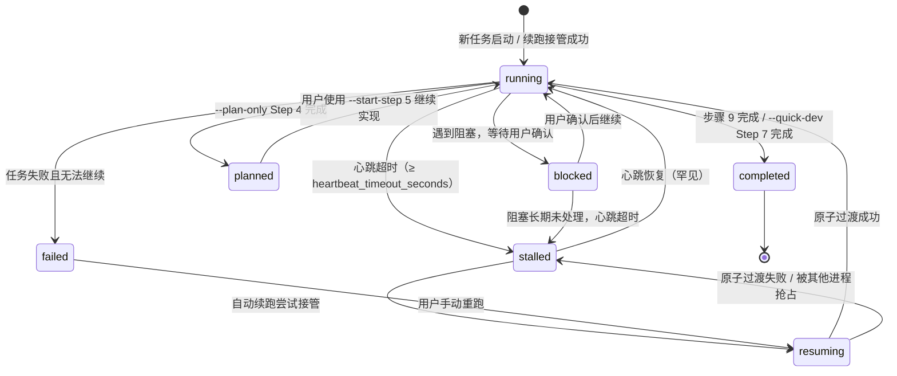

# 心跳与续跑规则

> 本规则被 `fully-coding/SKILL.md`、`agents/orchestrator.md`、`fully-coding-batch/SKILL.md` 与 `hooks/pre-execution-hook.md` 引用，作为心跳与续跑的唯一规范来源。

## 1. 心跳字段

每个任务的 `{{config.output_dir}}/{ts}-codingLog.md` frontmatter 维护以下字段：

```yaml
---
type: coding-log-template
status: running
last-heartbeat: 20250615-120530
current-step: 5
current-role: developer
pid: 12345
batch-subtask: false  # batch 子任务为 true
---
```

- `status`：任务状态，取值 `running / resuming / blocked / stalled / failed / planned / completed`
  - `running`：正在执行
  - `resuming`：过渡状态，表示某 resume 线程正在尝试接管，防止多线程同时 resume
  - `blocked`：遇到阻塞，等待用户确认
  - `stalled`：心跳超时，原进程无响应
  - `failed`：任务失败且无法继续
  - `planned`：`--plan-only` 已完成 Step 1-4，等待用户确认是否继续实现
  - `completed`：已完成
- `last-heartbeat`：上次心跳时间，格式 `yyyyMMdd-HHmmss`
- `current-step`：当前步骤编号
- `current-role`：当前角色名称
- `pid`：当前 Orchestrator 进程标识符

## 2. 任务状态流转



状态说明：

- `running` → `blocked`：流程中断且必须用户确认。
- `running` → `stalled`：原进程心跳超时，视为失联。
- `stalled` → `resuming`：resume 线程尝试接管，写入 `resuming` 状态防止多线程竞争。
- `planned`：`--plan-only` 已完成 Step 1-4，未修改代码；用户可用 `--start-step 5 --task-id {ts}` 继续完整实现闭环。
- `resuming` → `running`：当前进程确认成功取得控制权，开始正式执行。
- `resuming` → `stalled`：确认失败（被其他进程抢占或写入失败），放弃本轮 resume。

## 3. 心跳更新义务

任务执行期间，Orchestrator 必须在以下时机更新 `last-heartbeat`：

1. 每进入新步骤时；
2. 每完成一个关键动作时（如代码编辑、测试通过、文档落盘）；
3. 每 `heartbeat_interval_seconds` 秒（由 `project-config.md` 配置，默认 300 秒）。

同时更新 `current-step`、`current-role`、`pid` 为当前值。

## 4. `pid` 字段的辅助地位

`pid` 仅作为判断原 Orchestrator 进程是否仍然存活的辅助信号，**不凌驾于心跳超时之上**。

- 若 `pid` 存活，但 `last-heartbeat` 已超时（≥ `heartbeat_timeout_seconds`），视为原进程心跳失联，允许接管；
- 若 `pid` 已死亡，但 `last-heartbeat` 未超时，视为原进程可能已重启或心跳丢失，按心跳未超时处理，禁止接管；
- 若 `pid` 不存在或为空，退化为仅用心跳超时判断。

## 5. 进程存活检查

resume 前必须结合 `pid` 判断原进程是否仍在运行：

- **Linux/macOS**：`kill -0 {pid}` 返回 0 表示进程存活；
- **Windows**：`tasklist /FI "PID eq {pid}"` 结果中包含该 PID 表示存活；
- **pid 不存在或为空**：视为旧任务未记录进程号，退化为仅用心跳超时判断。

> 注意：PID 可能复用。即使 `tasklist` 显示 PID 存在，也应结合心跳超时综合判断，参见第 4 节。

## 6. 续跑前心跳校验（强制）

任何 `--auto-resume`、显式 `--task-id` 重跑、或用户要求续跑前，必须按以下顺序判断：

1. **codingLog.md 存在性**：确认目标 `{{config.output_dir}}/{ts}-codingLog.md` 存在。
2. **状态检查**：
   - 若 `status == completed`，禁止续跑，提示用户任务已完成。
   - 若 `status == planned`，仅允许用户显式传入 `--start-step 5 --task-id {ts}` 继续实现；普通 `--auto-resume` 不自动接管 planned 任务。
   - 若 `status == blocked` 且 `{ts}-blockLog.md` 中存在「用户确认状态：待确认」的事件，不得直接恢复，必须通知用户等待确认。
   - 若 `status == resuming` 且 `last-heartbeat` 距离当前时间小于 `heartbeat_timeout_seconds` → 已有其他 resume 线程在接管，跳过本轮 resume。
   - 若 `status == resuming` 但 `last-heartbeat` 已超时 → 上一次 resume 未成功进入 `running`，按 stalled 处理，允许重新接管。
3. **进程存活检查**：
   - 若 frontmatter 中存在 `pid` 且该 PID 对应进程仍存活 → 旧任务仍在运行，禁止新任务/续跑进入。
   - 若 `pid` 不存在或进程已死亡 → 继续下一步判断。
   - **例外**：即使 `pid` 存活，若心跳已超时，仍按第 4 节允许接管。
4. **心跳超时检查**：
   - 若 `status == running` 且 `last-heartbeat` 距离当前时间小于 `heartbeat_timeout_seconds` → 旧任务仍被认为在运行，禁止新任务/续跑进入。
   - 若 `status == running` 且 `last-heartbeat` 距离当前时间大于等于 `heartbeat_timeout_seconds` → 旧任务心跳已超时，将 `status` 改为 `stalled`，允许安全接管。
   - 若 `status == stalled` / `failed` → 允许直接接管。
5. **接管续跑（原子过渡）**：
   - 先将 `codingLog.md` frontmatter 更新为 `status=resuming`、`last-heartbeat` 为当前时间、`pid` 为当前进程 PID。
   - 确认写入成功后，再次读取 frontmatter；若 `status` 仍为 `resuming` 且 `pid` 与当前进程一致，则正式进入执行，将 `status` 改为 `running`。
   - 若再次读取确认时发现 `status` 已被其他进程改为 `resuming` 或 `running`，或 `pid` 不一致，**必须放弃本轮 resume**，不得继续执行。

## 7. 自动续跑流程

### 7.1 传入 `--task-id`

1. 定位到 `{{config.output_dir}}/{ts}-codingLog.md`。
2. 按第 6 节执行心跳校验。
3. 检查 `{ts}-blockLog.md`：若存在未确认阻塞事件，通知用户或跳过。
4. 执行第 6 节原子过渡，取得 `running` 状态。
5. 读取 codingLog.md 最后一个已填写章节，确定当前步骤 N。
6. 从步骤 N 继续执行。

### 7.2 未传入 `--task-id`（独立任务自动续跑）

1. 扫描 `{{config.output_dir}}/` 下所有 `{ts}-codingLog.md`。
2. 筛选 `status != completed` 的任务作为候选。
3. 对每个候选任务执行第 6 节心跳校验。
4. 选择最新一个 `stalled` / `failed` 任务作为续跑目标。
5. **排除批次子任务**：跳过包含 `batch-subtask: true` 元数据的 codingLog.md（此类任务由 `fully-coding-batch` 统一调度）。
6. 检查 blockLog.md：若存在未确认阻塞事件，按第 8 节处理。
7. 执行原子过渡并恢复执行。

## 8. auto-resume 与 blockLog.md 联动

自动续跑时，**必须先检查 blockLog.md**：

1. 若存在 `{ts}-blockLog.md` 且包含「用户确认状态：待确认」的阻塞事件：
   - 不得直接恢复执行；
   - 向用户报告该未解决阻塞：阻塞步骤、原因、修复建议；
   - 询问用户是否已处理（Y/n）；
   - 用户确认已处理：更新 blockLog.md 对应事件为「已确认」，填写「用户处理方案」和「解决时间」，然后继续恢复；
   - 用户未处理：保持暂停，本轮 resume 跳过。
2. 若 blockLog.md 不存在或所有阻塞事件均已确认：
   - 按正常 auto-resume 逻辑继续。

## 9. 记录续跑日志

若 `--auto-resume` 实际接管了旧任务，必须记录日志到 `{{config.output_dir}}/AUTO-resume-{date}.log`，格式遵循 `templates/auto-resume-log-template.md`。

## 10. 批量 Orchestrator 心跳

`fully-coding-batch` 的批次进度文档 `BATCH-{batch-ts}-progress.md` 同样使用 frontmatter 维护心跳：

```yaml
---
type: batch-progress
batch-timestamp: {yyyyMMdd-HHmmss}
status: running
last-heartbeat: {yyyyMMdd-HHmmss}
current-subtask: {tsN}
pid: {process-id}
---
```

- 启动批次时写入 `status=running`、`last-heartbeat`、`current-subtask`、`pid`；
- 执行期间每启动/完成一个子任务、或每 `heartbeat_interval_seconds` 秒更新心跳；
- 子任务阻塞时更新 `status=blocked`；
- 批次完成时更新 `status=completed`。

批量 Orchestrator 的 resume 逻辑与本规则一致，额外检查子任务与其他独立任务是否仍在运行。
