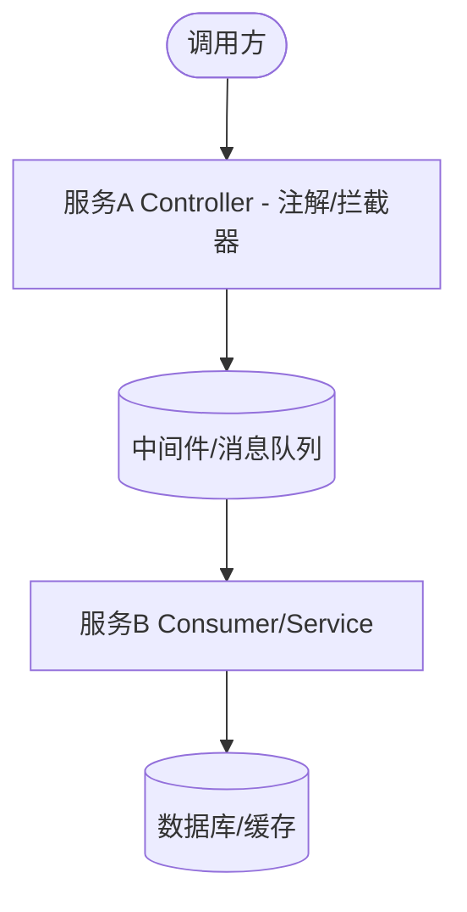
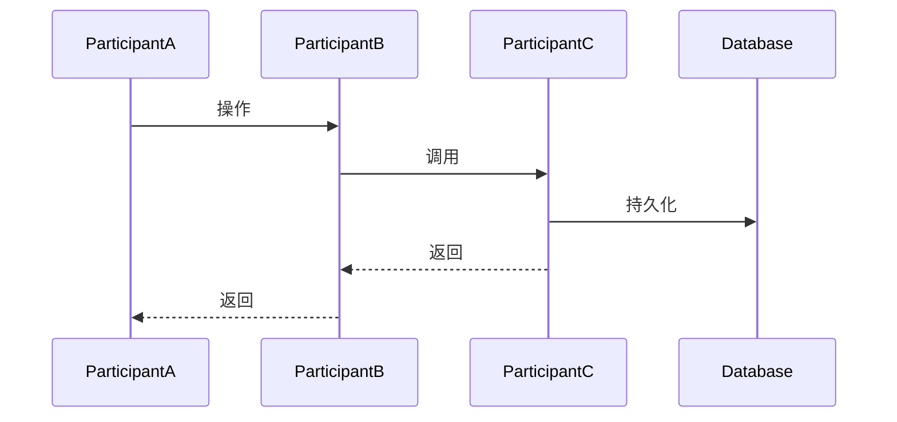

# 功能实现 - [功能描述]

> 文档定位：[一句话说明本文聚焦的功能域与边界，例如“聚焦管理端 XX 功能的后端实现与治理闭环；会员端相关能力见 `6.功能实现-xxx.md`”]
>
> 最后更新：[YYYY-MM-DD]
>
> 聚合范围（仅聚合文档填写）：[说明本文合并了哪些历史文档，例如“合并原 `6.功能实现-a.md`、`6.功能实现-b.md`，后续统一在本文维护”]

## 一、需求背景与目标

### 1.1 背景

阐述该功能要解决的业务痛点或技术痛点，说明其在系统中的定位和重要性。

### 1.2 当前问题

| 问题类型 | 具体问题 | 影响 |
| --- | --- | --- |
| [类型1：如数据模型割裂] | [具体问题描述] | [对系统的影响] |
| [类型2：如缺少关键功能] | [具体问题描述] | [对业务的影响] |
| [类型3：如性能瓶颈] | [具体问题描述] | [对用户体验的影响] |

---

## 二、业务需求

### 2.1 [场景名称1]

**场景描述**：详细描述该场景的业务背景、触发条件、参与角色。

**需求要点**：

- 要点1：如记录操作者身份
- 要点2：如记录操作内容
- 要点3：如记录关键信息

### 2.2 [场景名称2]

**场景描述**：...

**需求要点**：

- ...

### 2.3 [场景名称3]

**场景描述**：...

**需求要点**：

- ...

---

## 三、验收规则（根据业务需求衍生）

### 3.1 功能清单

| 功能点 | 描述 |
| --- | --- |
| [功能点1] | [详细描述] |
| [功能点2] | [详细描述] |
| [功能点3] | [详细描述] |

### 3.2 功能验收

** [功能点1]验收 ** 

- [ ] [验收项1：如接口响应符合契约]
- [ ] [验收项2：如关键功能正常]
- [ ] [验收项3：如边界场景覆盖]

### 3.3 非功能验收

- [ ] **性能**：[性能指标，如 P99 < 100ms]
- [ ] **安全**：[安全验收项]
- [ ] **合规**：[合规验收项]
- [ ] **兼容性**：[兼容性验收项]

---

## 四、技术方案

### 4.1 调用链

需要有明确的数据流转过程，细化到接口粒度。优先用 mermaid `flowchart` 表达跨服务/跨层数据流；线性单链路也可用下方文本箭头。



### 4.2 时序图

绘制关键交互过程的时序图，统一使用 mermaid `sequenceDiagram`（含分支用 `alt/else/end`）。



### 4.3 接口与事务

| 服务 | 接口名 | 请求格式 | 响应格式 | 说明 | 事务类型 |
| --- | --- | --- | --- | --- | --- |
| [service] | [HTTP方法 + 路径] | [请求JSON字段] | [响应JSON字段] | [接口说明] | [REQUIRED/NONE/SUPPORTS] |

### 4.4 表结构

**数据库初始化约定**：dev 环境各 DB-backed 后台服务仅以服务内 `src/main/resources/init.sql` 作为权威初始化入口（按服务固定路径，如 `xxx-app/src/main/resources/init.sql`，覆盖对应 schema）；历史 `docs/ddl`、`docs/dml`、DAO migration 仅作为来源参考，不再作为执行入口。`init.sql` 须用 `CREATE TABLE IF NOT EXISTS` + `CREATE INDEX IF NOT EXISTS` 保证可重复执行，菜单/权限点/角色等用 `ON CONFLICT DO UPDATE` 维护；存量环境的结构变更走 `db/migration/V{n}__xxx.sql`。

#### [表名] 表

| 字段 | 类型 | 索引 | 说明 |
| --- | --- | --- | --- |
| [field] | [类型] | [PRIMARY KEY/INDEX] | [字段说明] |

**约束**：

- `CONSTRAINT ck_xxx CHECK (field IN (...))`

**分区策略**：

- 分区字段：[field]
- 分区粒度：[如按季度 RANGE 分区]
- 分区命名：[如 table_YYYYqN]
- 自动管理策略：[如预创建下一周期分区]

### 4.5 异常处理与降级

#### 4.5.1 [异常场景1：如中间件故障]

```
[异常触发点]
  ↓
[降级策略]
  ↓
[备选方案]
  ↓
[告警/监控]
```

#### 4.5.2 [异常场景2：如依赖服务超时]

```
[异常触发点]
  ↓
[降级策略]
  ↓
[备选方案]
```

#### 4.5.3 [异常场景3：如大数据量处理]

```
[触发条件]
  ↓
[异步处理策略]
  ↓
[结果通知机制]
```

### 4.6 合规、安全性、监控

#### 4.6.1 鉴权要求

- [操作1]：[鉴权要求，如 JWT Token + ADMIN 角色]
- [操作2]：[鉴权要求]

#### 4.6.2 脱敏要求

**自动脱敏字段**：

- [字段类别1]：`field1`, `field2`, `field3`
- [字段类别2]：`field4`, `field5`

#### 4.6.3 审计要求

- [审计要求1]
- [审计要求2]

#### 4.6.4 合规要求

- **N-04 用户适当性分级**：
  - 合规要求详情
- **N-05 用户数据权利**：
  - 合规要求详情
- **N-08 LLM守门员**：
  - 合规要求详情

#### 4.6.5 一致性保证

- **一致性策略**：[如 HMAC 签名、CRC 校验]
- **验证机制**：[如何验证数据完整性]

#### 4.6.6 幂等性保证

- **幂等键**：[如 traceId、业务主键]
- **去重策略**：[如数据库唯一索引、Redis SETNX]

#### 4.6.7 限流设计

仅当功能涉及高频/资源敏感入口（如 AI 调试、查询接口）时填写；普通 CRUD 可省略本节。

**Redis Key**：

- 分钟限流：`[biz]:limit:{userId}:min`
- 日限流：`[biz]:limit:{userId}:day`
- 锁定：`[biz]:lock:{userId}`

**Lua 滑动窗口脚本（示例）**：

```lua
local key = KEYS[1]
local lockKey = KEYS[2]
local window = tonumber(ARGV[1])
local limit = tonumber(ARGV[2])
local lockSeconds = tonumber(ARGV[3])
local lock = redis.call('GET', lockKey)
if lock then return {-1, redis.call('TTL', lockKey)} end
local now = redis.call('TIME')[1] * 1000000 + redis.call('TIME')[2]
redis.call('ZREMRANGEBYSCORE', key, 0, now - window * 1000000)
local count = redis.call('ZCARD', key)
if count >= limit then
    redis.call('SET', lockKey, '1', 'EX', lockSeconds)
    return {-1, lockSeconds}
end
redis.call('ZADD', key, now, now)
redis.call('EXPIRE', key, window)
return {limit - count - 1, 0}
```

#### 4.6.8 监控指标

| 指标 | 说明 | 告警阈值 |
| --- | --- | --- |
| `quant_xxx_total` | [指标说明] | - |
| `quant_xxx_failed_total` | [失败指标说明] | [阈值 + 告警级别] |
| `quant_xxx_latency` | [延迟指标说明] | [P99 阈值 + 告警级别] |

#### 4.6.9 告警规则

- **[告警条件1]** → [告警级别]
- **[告警条件2]** → [告警级别]
- **[告警条件3]** → [告警级别]

### 4.7 前端目录结构

若功能涉及前端页面、路由或菜单，必须在此明确新增/修改的前端文件路径，并与项目现有 `src/views/` 目录风格保持一致。

| 端 | 页面/组件 | 实际路径 | 路由 | 说明 |
| --- | --- | --- | --- | --- |
| admin-biz-web | [页面名] | `src/views/...` | [路由] | [说明] |
| member-biz-web | [页面名] | `src/views/...` | [路由] | [说明] |

**目录风格确认**：

- 本次新增页面采用 [扁平 / 按一级菜单 / 按模块] 风格
- 依据：扫描现有 `src/views/` 目录后，项目当前主流风格为 `...`
- 若跨端功能涉及多个端，各端目录风格分别确认

---

## 五、风险与依赖分析

| 风险/依赖 | 类型 | 影响 | 缓解措施 |
| --- | --- | --- | --- |
| [风险1：如中间件故障] | 技术 | [高/中/低] | [缓解措施详情] |
| [风险2：如安全漏洞] | 安全 | [高/中/低] | [缓解措施详情] |
| [依赖1：如外部服务] | 外部依赖 | [高/中/低] | [缓解措施详情] |
| [依赖2：如数据库特性] | 技术 | [高/中/低] | [缓解措施详情] |
| [成本：如存储成本] | 成本 | [高/中/低] | [缓解措施详情] |

---

## 六、附录

### 6.1 核心类清单

| 类名 | 路径 | 职责 |
| --- | --- | --- |
| [ClassName] | [package/path/ClassName.java] | [职责描述] |
| [ClassName] | [package/path/ClassName.java] | [职责描述] |

### 6.2 配置示例

```yaml
[配置项]:
  [子配置项]:
    [具体配置]: [值]
```

### 6.3 错误码设计

本次新增/复用的错误码。编码规则遵循 `_knowledge/5.服务详细设计（错误码段位分配）.md`：错误码由系统代号（SS，十六进制）+ 领域段位（D）+ 语义位组成；若本次无新增，注明“复用 xxx-svc 已有错误码”。

| 错误码 | 含义 | 使用场景 |
| --- | --- | --- |
| `[如 10033A]` | [如通用参数错误] | [如 SQL 为空或格式非法] |
| `[如 10733A]` | [如业务规则校验失败] | [如 SQL 审核未通过] |


------【分割线】以上是模版内容，以下是注意事项（无需出现在正式文档中）---------------------------

1. 无需做开发周期的规划、子功能优先级评估，请直接输出完整的方案。
2. 无需罗列API请求示例，使文档保持轻量。
3. 图表统一用 mermaid：调用链/数据流/架构用 `flowchart`，时序交互用 `sequenceDiagram`，状态机用 `stateDiagram`；不要用 ASCII 框线图。
4. **可选节按需填写**：4.6.7 限流设计、6.3 错误码设计仅当功能命中对应场景时输出，普通 CRUD 可省略并注明“无”。
5. **聚合文档**：当一个文档合并多个子功能模块时，每个子模块标题上方加 `> 来源：6.功能实现-xxx.md` / `> 关联菜单：` / `> 关联服务：` 引用块；全文第一节用“聚合范围”说明合并了哪些历史文档。
6. **纯前端功能**（如管理端客服中心-工单管理）：不套用本模板的技术方案节，改用前端 6 节结构——①菜单设计 ②页面与组件（逐组件列筛选栏/表格列/操作按钮/弹窗/交互） ③API 层封装（`src/api/*.ts` 函数-路径-说明） ④路由配置 ⑤图标与侧边栏/iconMap ⑥关键实现点。涉及全链路契约时补“前端函数 ↔ 网关 ↔ 后端路径 ↔ 数据源”字段级对照表。
7. **后端分层清单**：后端实现节可补 DDD 四层文件清单（api: Request/Response；dao: Po+Mapper；app: ApplicationService+Controller；domain: DomainService），并区分“新增文件 / 修改文件”两张表。
8. **兼容与下线治理**：涉及 schema 迁移、字段保留兼容、功能下线（删路由/删页面/清 mock）时，单列一小节说明影响范围与存量环境处理步骤。
